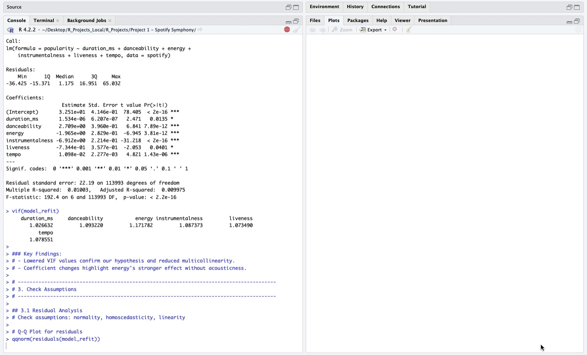

# [🎵 Spotify Symphony: A Linear Regression of Spotify Data 🎵](./Spotify%20Symphony.R)



## 🚀 **Introduction**  
So, here's the deal: I was given a dataset of Spotify songs, and instead of just running some basic analysis, I decided to turn it into my own little musical adventure. The question I started with? What actually makes a song popular on Spotify? Through Formidable Formulas, Nebulous Numbers, and Enigmatic Equations I embarked on a mathmatical journey into understanding what makes songs tick — and maybe, just maybe, uncover some of the magic behind the Spotify algorithm.

---

## 🎯 **Objectives**  
1. 🕵️‍♂️ Understand the significant factors influencing **song popularity**.  
3. ✅ Ensure **model assumptions** (normality, homoscedasticity, linearity) are met.
3. 🔄 Refine the model for better accuracy.   

---

## 🛠 **Skills and Tools**  
- **Programming Language:** R  
- **Libraries:** `ggplot2`, `lm`, `car`, etc.  
- **Skills Demonstrated:** Data wrangling, linear regression analysis, model diagnostics, hypothesis testing, residual analysis.

---

## 📊 Data Overview  

The `spotify_data.csv` includes information about Spotify songs, focusing on numerical characteristics that may influence song popularity. Below are the covariates analyzed:  

- 🎵 **Popularity**: A measure of how well a track is received, based on streaming counts and social media buzz. 
- ⏳ **Duration_ms**: The length of the track in milliseconds.  
- 💃 **Danceability**: A score reflecting how suitable a track is for dancing.  
- ⚡ **Energy**: An estimate of the intensity and activity level of a track.  
- 🎸 **Acousticness**: A measure of how acoustic (non-electronic) a track sounds.  
- 🎻 **Instrumentalness**: A score that predicts the likelihood of a track having no vocals.  
- 🎤 **Liveness**: A measure of whether it feels like a live performance.  
- 🎚️ **Tempo**: The speed of the track, measured in beats per minute (BPM).

---

## 🔧 **Methodology** (Parts 1-6)

### **1. 📂 Data Preparation**  
- **Imported** the dataset and previewed its structure to make sure everything loaded properly.

### **2. 🛠 Model Development**  
- Built an **initial linear regression model** to explore relationships between predictors and song popularity.
- Later, checking VIF values if multicollineariy was skewing our results.
- Removed acoustiness and refit the model as it was skewing the model fit.

### **3. 🔍 Assumption Checks**  
- Evaluated **model assumptions**:    
  1. **Normality** using Q-Q plots and histograms.  
  2. **Homoscedasticity** via residual vs. fitted plots.  
  3. **Linearity** through scatter plots.

Example of code used for plot analysis:
```R
# Q-Q plot for residuals to check normality
qqnorm(residuals(model_refit))
qqline(residuals(model_refit), col = "red")

# Histogram of residuals
hist(residuals(model_refit), col = "green", main = "Histogram of Residuals", xlab = "Residuals")

# Residuals vs Fitted plot to check homoscedasticity and linearity
plot(fitted(model_refit), rstudent(model_refit), 
     main = "Residuals vs Fitted Values", xlab = "Fitted Values", ylab = "Residuals")
abline(h = 0, col = "red")
```

### **4. ✂️ Model Refinement**  
- Enhanced the model through filtering problematic values by:  
  - **Excluding zero-popularity songs** which were violating assumptions.  
  - **Removing weak predictors** to improve model stability.

### **5. 🕵️‍♂️ Outliers and Influence Analysis**  
- Analyzed high-leverage and influential points using:  
  - **Hat values** for leverage.  
  - **Cook’s distance** for influence.

  Example of code used for this analysis:
```R
# Calculate leverage points using hat values
hat_values <- hatvalues(model_reduced)
high_leverage <- mean(hat_values > (2 * length(coef(model_reduced)) / nrow(spotify_filtered)))
cat("High-leverage observations:", high_leverage * 100, "%\n")
```

### **6. ✅ Overall Results**  
- Summarized key findings:  
  - 🎉 **Danceability** had a positive relationship on song popularity.   
  - ❌ **Energy, acousticness**, and **instrumentalness** negatively affected popularity.  
  - 🔺 Approximately **7%** of the data had high leverage.    
  - 🔮 No single observation was disproportionately affecting the model's coefficients.   
  - 📉 Most variability of the data remains **unexplained**.  

---

### **Conclusion**  
 
🎵 Turns out, **danceability** emerged as the MVP of song popularity, while **energy, acousticness, and instrumentalness** brought the vibe down. Despite refining the model and addressing issues like multicollinearity and zero-popularity songs, it explained only 0.5% of variability. But hey, progress is progress. We tackled multicollinearity, fixed assumption violations, and checked outlier affects. Overall, a sucessful project!

---

### **Future Recommendations**

⚠️ Even with all the tweaks and fixes, there’s still a ton of variability in popularity that the model couldn’t explain.

   - 🚀 To point us in the right direction I recommend the following moving forward:

     1. 📂 **Include More Covariates** - Add features such as **song genre**
     2. 🔗 **Add Interaction Terms** -  Explore how variables interact and contribute to song popularity when combined
     3. 🤖  **Try Advanced Models** - Experiment with **machine learning** models to uncover deeper patterns

---
### 📂 Access the R-File  

Click [here](./Spotify%20Symphony.R) to explore the **Spotify Symphony** code in more detail.  


(Note: please download the **spotify_data.csv** as well and make sure the **working directory** is set to your local system)

---

- Check out some of my other work:  
  - [📊 SQL Projects](https://github.com/JulianGriffin11/SQL_Projects)  
  - [📘 Excel Projects](https://github.com/JulianGriffin11/Excel_Projects)

Sincerely,  
Julian

