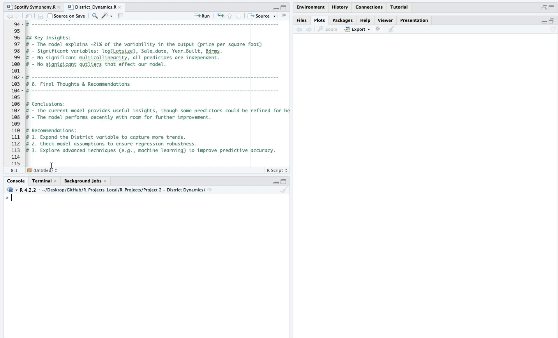
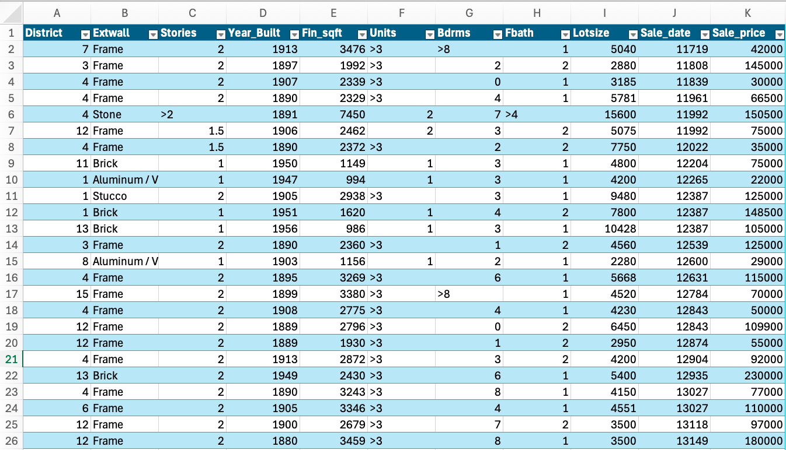
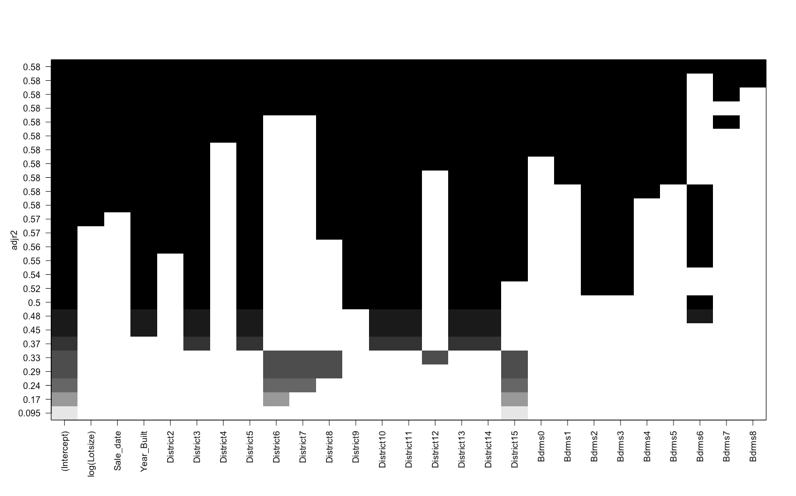

# [🏢 District Dynamics: Housing Market Analysis 🏢](./District_Dynamics.R)



---

## 🚀 **Introduction**  

Step into the world of District Dynamics with me! In this project, I dive deep into a treasure trove of real estate data to uncover the mysterious forces that control housing prices. My journey revolves around the price per square foot, as I try to figure out how lot size, number of bedrooms, and sale date all fit into the big picture. Join me in this adventure—you might even learn something about pricing that could save you a fortune!

---

## 🎯 **Objectives**  
1. 📊 Identify key factors influencing **price per square foot**.  
2. ✅ Ensure **variable selection** is maximized.  
3. ⏪ Check for **possible outliers** influencing the model. 

---

## 🛠 **Skills and Tools**  
- **Programming Language:** R
- **Libraries:** `leaps`, `car` 
- **Skills Demonstrated:** Outlier detection, multicollinearity checks, data cleaning, linear regression, model refinement

---

## 📊 **Data Overview**  
Key variables include:

- **Sale_price**: Total sale price of the house.
- **Lotsize**: Size of the lot in square feet.
- **Fin_sqft**: Finished square footage of the house.
- **Sale_date**: Date of the transaction.
- **Year_Built**: Year the house was constructed.
- **District**: A categorical variable representing neighbourhoods.
- **Bdrms**: Number of bedrooms.



A log-transformed variable, **ppsq** (price per square foot), serves as the dependent variable.

---

## 🔧 **Methodology** (Steps 1-5)

### **1. 📂 Data Wrangling**  
- Loaded the dataset and filtered out unrealistic values:
  - **Lotsize** > 0
  - **Sale_price** ≥ $10,000
  - **Fin_sqft** ≥ 500
- Computed log-transformed price per square foot.
  

### **2. 📖 Model Construction**  

- Next step was to fit a multiple linear regression model:
``` R
linear_model <- lm(ppsq ~ log(Lotsize) + Sale_date + Year_Built + District + Bdrms, data = clean_data_refit)
summary(linear_model)
```

- Subsequently, I checked multicollinearity with Variance Inflation Factor (VIF).


### **3. 🔄 Variable Selection**  
- Performed **all-subsets regression** using the leaps package:



- Key Takeaways:
  - As we can see LotSize, Sale_Date, Year_Built, District12, and District5 are key predictors.
  - Adding more regressors doesn't necessarily equal a better model.


### **4. 🧰 Outlier & Influence Analysis**  
- Identified high-leverage points and influential observations:
``` R
hat_values <- hatvalues(linear_model)
high_leverage <- mean(hat_values > (2 * length(coef(linear_model)) / nrow(clean_data_refit)))
cat("High-leverage observations:", high_leverage * 100, "%\n")
```
#### Highlighted Analysis:
- Leverage points account for about 2% of our data.
- Nevertheless, none of these data points negatively affect our model.
  

### **5. ⚖️ Key Findings**  
- The model explains **21% of the variability** in price per square foot.
- Significant predictors: **log(Lotsize)**, **Sale_date**, **Year_Built**, **Bdrms**.
- Multicollinearity was **not significant**.
- No **outliers** significantly affected our model fit.


---

## 🔒 **Conclusions & Recommendations**

### **Conclusions**
Through careful **data wrangling**, **regression modeling**, and *outlier analysis*, I've built a model that explains **21%** of price variability. Key predictors, such as **lot size** and **sale date**, were identified, while *multicollinearity* wasn’t an issue. This project is a strong demonstration of my growing skills in **data analysis**, **regression modeling**, and refining models to extract valuable insights from housing data. 🏠📊🔍


### **Recommendations**
1. 🔣 **Enhance District Variable**: Break Districts down into more detailed neighbourhoods.
2. 🔠 **Assumption Testing**: Ensure robustness with assumption diagnostics.
3. 📶 **Explore Machine Learning**: Using a more advanced model will likely yield better accuracy.

---

### 📂 **Access the Files**  
💡 Click [here](./District_Dynamics.R) to view the full code.  
🧩 Click [here](./clean_data.csv) to view the dataset.

*Professional Note: Ensure the working directory is set to your local environment!*

---

- Discover my other work:
  - [📊 SQL Projects](https://github.com/JulianGriffin11/SQL_Projects)  
  - [📃 Excel Projects](https://github.com/JulianGriffin11/Excel_Projects)

All the best,  
Julian
