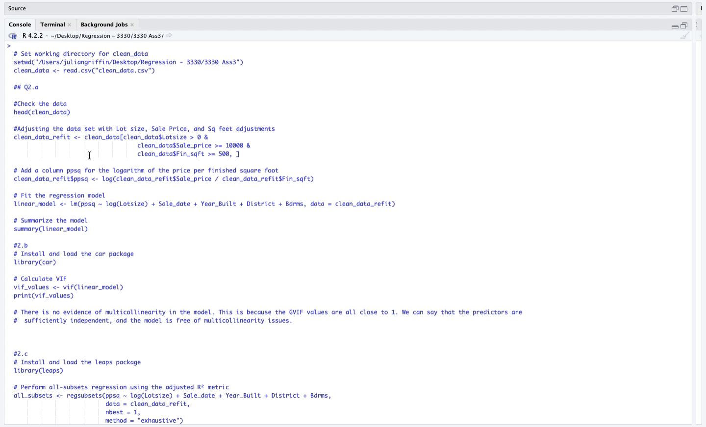

# 💻 R Projects

Welcome to my **R Projects** repository! 🎯  

Here you will find my **R-based data analysis** projects. Use the **links below** to dive into each project!

---

## 🗂️ Projects

### 1. [🎵 **Project 1 - Spotify Symphony** 🎵](./Project%201%20-%20Spotify%20Symphony) 
- **Summary**: This project dives into the world of Spotify data to uncover what drives song popularity. A linear regression model is built to explore relationships between various song attributes like danceability, energy, tempo, etc. 
- **Skills Learned**:  
  - Linear regression analysis  
  - Model diagnostics and assumption checks  
  - Data wrangling and visualization using various library like
- **Important Note**: Please make sure your working directory is set when running the file!
  

 

### 2. [🏡 **Project 2 - District Dynamics: Coming Soon!** 🏡](./Project%202%20-%20District%20Dynamics)  
- **Summary**: This project analyzes key housing data such as square footage, cost, and location to identify trends and detect outliers. I examine influential points to provide insights into the housing market.
- **Skills Learned**:  
  - Hypothesis Testing 
  - Outlier Detection  
  - Data Visualization
- **Important Note**: This project is currently in progess 🚧!
  

 

---

### Notes: 
- For each project, feel free to download the necessary data files (like `spotify_data.csv`) and run them on your local system.
- Ensure your **working directory** is set correctly in the project file to avoid path issues.
  
---

🚀 Click the heading links to dive deeper into each project! 🚀

Yours in solutions,   
**Julian Griffin :)**
